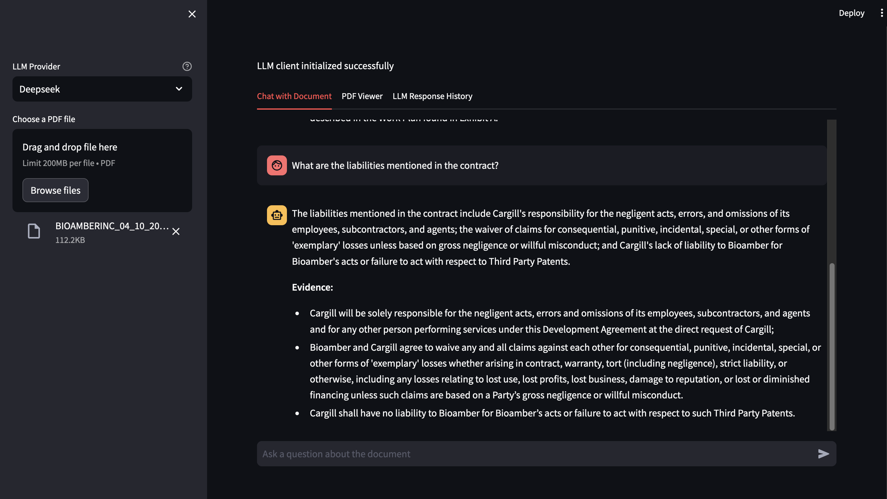

# PDF Viewer with Chat Application

An advanced Streamlit application for viewing and interacting with PDF documents using AI.

## Features
- Upload and view PDF files in the browser
- Chat interface for asking questions about the document
- AI-powered document understanding and question answering
- Advanced evidence highlighting in PDF with:
  - Custom highlight colors
  - Handling of hyphenated words across line breaks
  - Normalization of spaces and special characters
  - Multiple search variations for better matching
- Wide layout for better viewing experience
- Local or remote LLM integration (Ollama, Deepseek, OpenRouter)
- Enhanced document search with:
  - Text normalization for better matching
  - Handling of special characters and ligatures
  - Page navigation to found results

## Requirements
- Python 3.11
- PyPDF2
- PyMuPDF (fitz)
- Streamlit
- LangChain
- FAISS for vector search
- Ollama or other LLM provider
- Fuzzy string matching (fuzzywuzzy, python-Levenshtein)
- BM25 text retrieval (rank_bm25)

## Installation

1. Clone this repository:
   ```bash
   git clone https://github.com/yourusername/pdf-viewer.git
   cd pdf-viewer
   ```

2. Create and activate the conda environment:
   ```bash
   conda env create -f environment.yml
   conda activate phd
   ```

3. Install pip dependencies:
   ```bash
   pip install -r requirements.txt
   ```

4. (Optional) Set up Ollama or your preferred LLM provider

## Usage

Run the application:
```bash
streamlit run app.py
```

The application will open in your default web browser.

### Features:
- Upload PDFs via the sidebar
- Chat with the document using the chat interface
- View highlighted evidence in the PDF viewer
- Search for specific text in the document
- Navigate between pages with evidence

## Recent Updates

### Chat Interface Improvements
- Fixed chat history scrolling behavior
- Added fixed-height chat history container
- Improved chat input positioning
- Added error handling for empty prompts

### Evidence Highlighting
- Direct text matching with green highlights
- Fallback chunk matching with red highlights
- Improved text normalization for better matching
- Page navigation for highlighted evidence


## Screenshots




## Contributing

Pull requests are welcome. For major changes, please open an issue first to discuss what you would like to change.

## License

[MIT](https://choosealicense.com/licenses/mit/)
